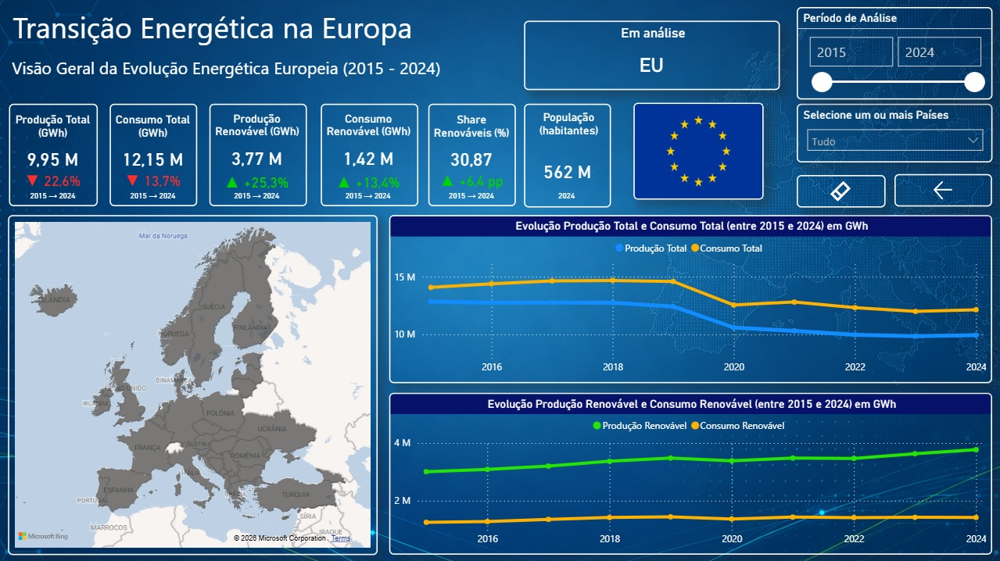
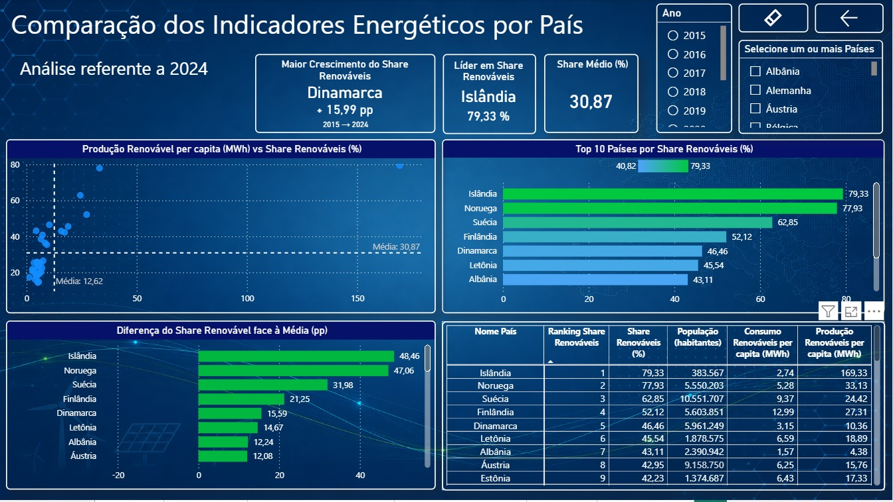
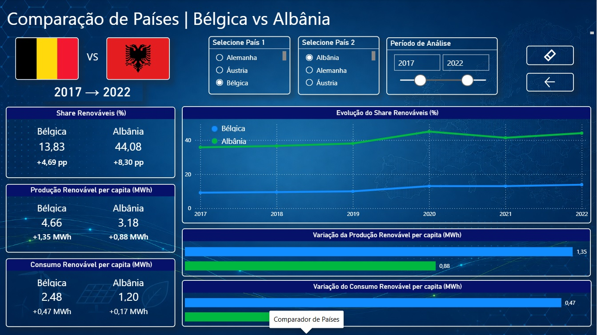
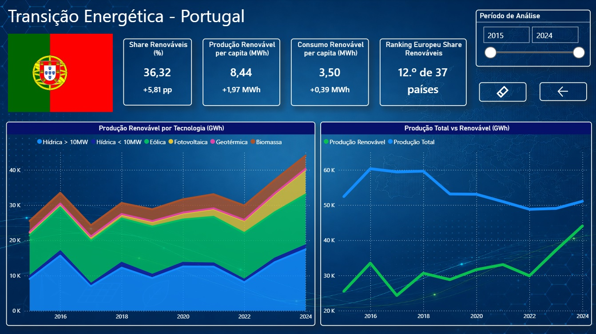
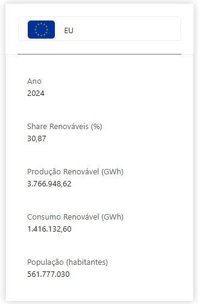

# European Energy Transition Analysis | Power BI

## Overview

This project explores the evolution of energy production, consumption and renewable energy across European countries between 2015 and 2024.

The dashboard was developed in Power BI to enable comparisons between countries, analyse renewable energy production and consumption per capita, track renewable energy trends and explore Portugal's energy transition in greater detail.

## Key Questions

The analysis aims to answer questions such as:

- How has energy production and consumption evolved across Europe?
- Which countries lead in renewable energy share and renewable energy production per capita?
- How has the share of renewable energy changed since 2015?
- How do individual countries compare with the European Union?
- How has Portugal's energy mix evolved?

## Tools & Skills

- Power BI
- Power Query
- DAX
- Data modelling
- Data cleaning and transformation
- KPI development
- Data visualisation

## Data Sources

The project uses publicly available data from:

- Eurostat
- PORDATA

The analysis covers the period **2015–2024**.

## Key Insights

- Across the countries analysed, the renewable energy share reached **30.87%** in 2024, an increase of **6.4 percentage points** compared with 2015.
- Renewable energy production across the analysed dataset increased by approximately **25.3%**, while total energy production decreased by **22.6%** between 2015 and 2024.
- Iceland recorded the highest renewable energy share in 2024 (**79.33%**), followed by Norway (**77.93%**) and Sweden (**62.85%**).
- Denmark recorded the largest increase in renewable energy share between 2015 and 2024, with an increase of **15.99 percentage points**.
- Portugal reached a renewable energy share of **36.32%** in 2024, an increase of **5.81 percentage points** compared with 2015.

## Dashboard

### European Overview

### Country Analysis

### Country Comparison

### Portugal Analysis

## Dashboard Features

The report includes:

- Dynamic country and year filtering
- Energy production and consumption KPIs
- Renewable energy production and consumption per capita
- Renewable energy share and evolution
- Country rankings
- Country-to-country comparison
- Dedicated analysis for Portugal
- Interactive navigation and tooltips

### Interactive Tooltip

## About the Project

This project was developed during a Business Intelligence training programme at **IEFP (Instituto do Emprego e Formação Profissional, Portugal)**.

The project allowed me to apply Power BI, Power Query, DAX and data modelling to real-world datasets, while combining data analysis with my previous experience in industrial operations and continuous improvement.

**Dashboard language:** Portuguese
